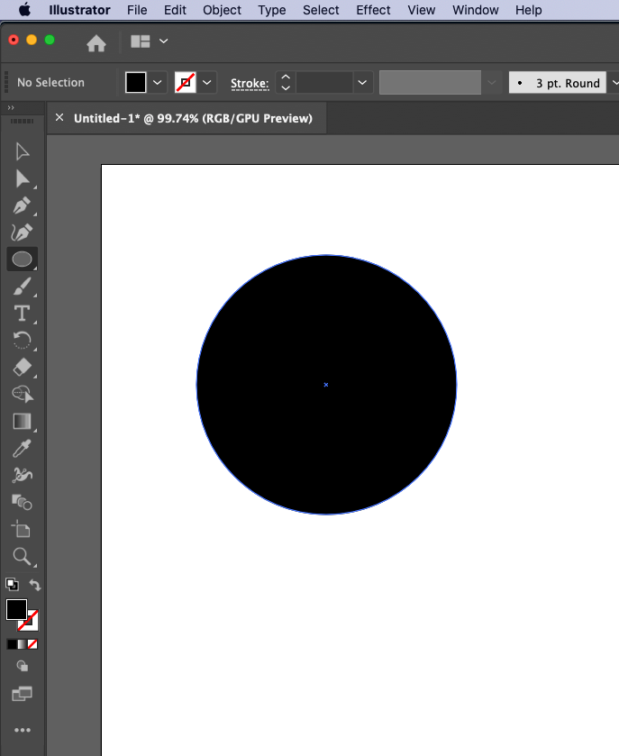
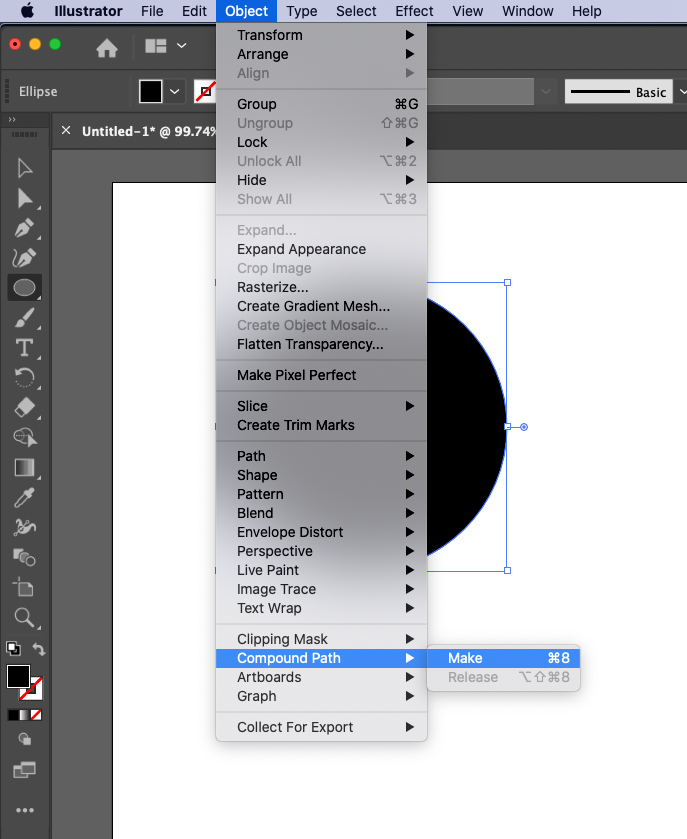
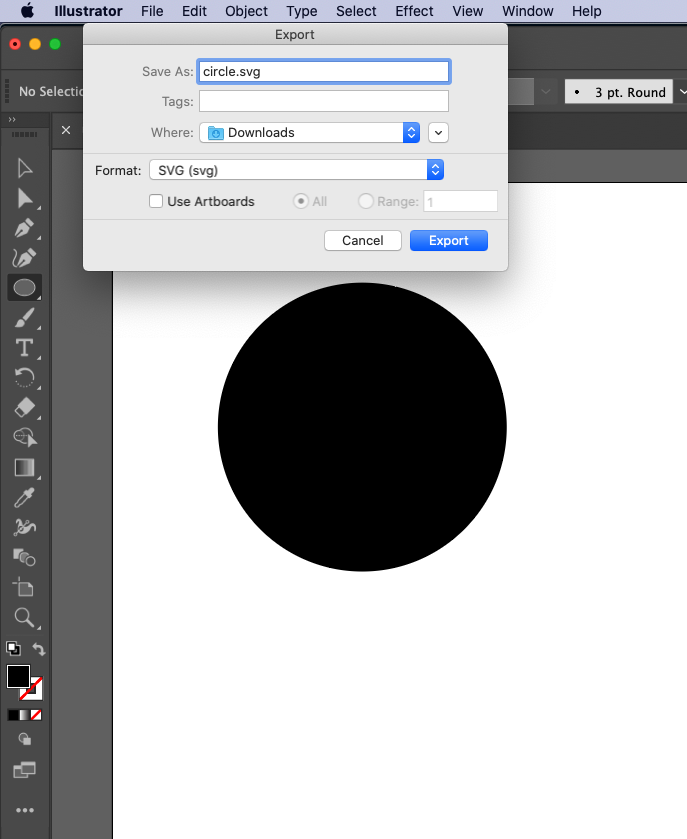
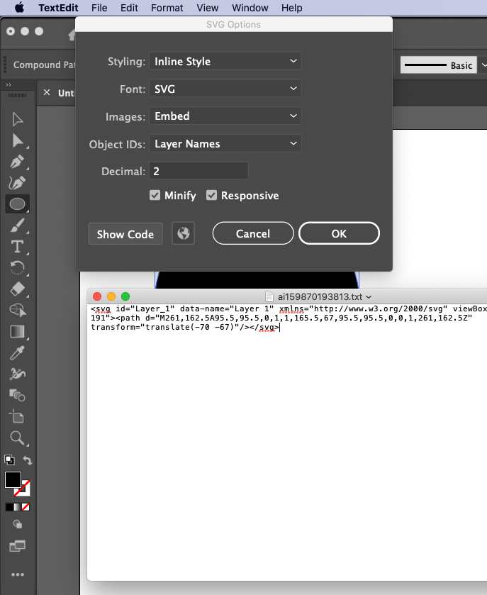

1편에 이어서,
Circular Progres Bar 구현에 대해 설명해보겠습니다.


<!-- more -->

svg path 점선을 이용해서 그리는 효과를 구현했다면,
원형으로 된 path svg를 만들어서 동일한 애니메이션을 구현하면 될 것입니다.

### 그렇다면, 어떻게 svg를 만들 수 있을까요?

여러가지 방법이 있을 수 있습니다.

- svg 문법을 익혀 원하는 모양을 만들기
  https://css-tricks.com/svg-path-syntax-illustrated-guide/
- 공개된 svg generator 를 이용하기
  https://codepen.io/anthonydugois/pen/mewdyZ
- 일러스트레이터를 이용해 그려서 svg로 추출

마지막 3번째 방법에 대해 설명 하겠습니다.
(물론 1번째 방법(svg 문법 익히기)을 조금 알면 모양을 짐작할 수 있습니다.)

마지막 3번째 방법은 일러스트레이터가 필요합니다.

1. circle을 그립니다.

   

2. compound path 를 make 합니다. 면을 선으로 만듭니다.
   이때 결과물이 원 circle로 보이지만, path style(fill property)을 이용하여 우리가 생각하는 선으로 제대로 보이게 할 수 있습니다.

   

3. svg 로 export 시킵니다.

   

4. showCode 를 눌러서 svg 코드를 볼 수 있습니다.

   

```html
<svg viewBox="{복사한 코드의 viewBox}">
  //(e.g) viewBox="0 0 22 22"
  <path class="path" d="{복사한 코드를 넣기}" />
</svg>
```

```css
.path {
  fill: none;
  stroke: #833ab4;
  stroke-width: 3px;
  stroke-dasharray: 56.6px;
  animation: dash 10s linear;
}

@keyframes dash {
  from {
    stroke-dashoffset: 56.6px;
  }
  to {
    stroke-dashoffset: 0;
  }
}
```

```js
var $path = document.querySelector(".path");
console.log($path.getTotalLength());
```

### 완성!

다음은 위 코드를 이용해서 만든 circular progress bar 입니다.
https://codepen.io/letsdoyi/pen/dyMPyWy

시간이 된다면, svg 문법을 익혀 원하는 모양을 만들기에 대해 정리한 포스팅을 하려고 합니다.
언제가 될지는 모르겠습니다.
