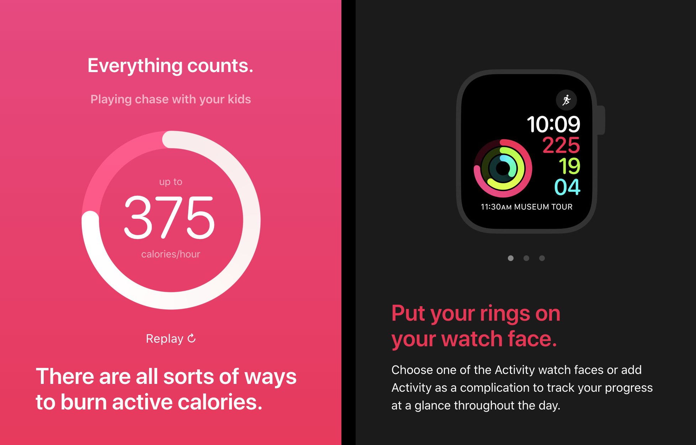
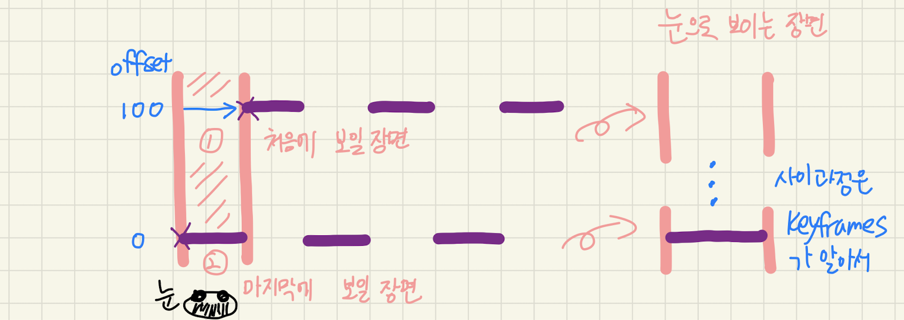

Circular Progress Bar를 구현하는 방법에 대해 정리해보려고 합니다.
Apple Watch activat ring, Donot 그래프, iPhone Timer, 음악앱에서 많이 보이는 재생시간 progress bar 등의 많은 곳에서 사용되고 있습니다.



<!-- more -->

여러가지 방식이 있겠지만, 제가 찾은 가장 단순한 방식은 SVG를 이용해서 구현하는 것이였고, 그 방식에 대해 정리해보겠습니다.

### 원리는 간단합니다.

SVG의 `path`를 `동그란 모양`으로 으로 `그려주면(그려주는 효과를 내면)` 됩니다.

### 먼저, 직선을 그리는 효과 및 구현을 간단히 정리해보겠습니다.

SVG의 path의 stroke 기능을 이용할 수 있습니다.
stroke의 점선 간격을 조절하여(정확하게는 점선의 실선부분의 위치를 조절하여) 구현할 수 있습니다.

점선 A(1000px 실선, 1000px 빈선(?) 1000px 실선, 1000px 빈선(?))을 상상해봅니다.
추가로 눈에 보이는 path 길이는 1000px로 정해져 있다고 상상합니다.
마치 1000px 가로 길이의 상자에 들어가 있다고 말입니다.
그 상자 안에는 거대한 점선 A가 천천히 왼쪽에서 오른쪽으로 움직입니다.
우리가 보는 관점에서는 선이 오른쪽에서 왼쪽으로 그려지는 것처럼 보여질 것입니다.

머릿속으로 코드를 구현해 봅니다.

- 시작점 설정: 실선 부분의 시작 위치가 1000px (1000px 가로 길이의 상자에서는 아무것도 없는 것처럼 보임)
- 끝점 설정: 실선 부분의 시작 위치가 0px (0px 가초 길이의 상자에서는 1000px의 실선의 전체가 보임)

- 이 둘 연결을 애니메이션 으로 연결하면 되겠네. from(아무것도 보이지 않음), to(실선이 모두 채워진 상태)
  `keyframes` 이 **알아서** 중간 frame 들을 연결 시켜줌 https://developer.mozilla.org/en-US/docs/Web/CSS/@keyframes
  

그럼 실제 코드로 정리해보겠습니다.

```html
<svg class="svg-box"><path class"path" d="M0,200,L1000,200 "/></svg> //시작점
(좌표처럼 생각) 0px, 200px //끝점 1000px, 200px
```

```css
.svg {
  width: 1000px;
  height: 100px;
  //viewBox로도 설정할 수 있습니다.
  background-color: red;
}

.path {
  stroke: black;
  stroke-width: 10px;
  stroke-dasharray: 1000px;
  //dasharray로 실선과 빈선을 모두 지정할 수 있습니다.
  //- value 가 하나인 경우, (e.g) stroke-dasharray: 50px, 50px짜리 실선과 빈선으로 이루어진 점선
  //- value 가 두개인 경우, (e.g) stroke-dasharray: 50px, 10px, 50px짜리 실선과 10px 짜리 빈선으로 이루어진 점선
  animation: draw 3s infinite;
  animarion-timing-function: linear;
}

@keyframes draw {
  from {
    stroke-dashoffset: 1000px;
    //점선 전체의 시작점을 설정합니다. 이 경우에는 "오른쪽으로"으로 "1000px 이동" 한 곳이 "전체 점선의 시작점" 입니다.
    //"dashoffset" 는 빈선이 아닌, 실선의 시작점(전체 점선의 시작점)을 의미합니다.
  }

  //중간의 일어나는 frame들은 keyframes이 알아서 만들고 컨트롤 합니다.

  to {
    stroke-dashoffset: 0px;
    //점선 전체의 시작점이 0px으로 설정
  }
}
```

다음은 위의 값을 실행시킨 것 입니다.
https://codepen.io/letsdoyi/pen/ZEWybya

제가 헷갈렸던 부분은

1. dashoffset의 의미를 이해하는 것
2. keyframes 이 중간 frame 들을 연결 시켜주는 원리를 도입 하는 것
   이였습니다.

처음에는 전체의 시작점이 1000px ~ 0px로 이동한다고 생각하여 선의 움직임을 반대로 예상하였습니다.

### 그렇다면, 마지막으로 선을 그리듯한 효과는 어떻게 내는 것인지 정리 해보겠습니다.

1. path stroke 이용
2. stroke-dasharray 이 `path 길이`와 같도록 설정
3. stroke-dashoffset(시작점 설정)를 `path 길이`와 0으로 설정하여 애니메이션 대입

참고로, path 길이는 DOM의 getTotalLength라는 메서드를 이용할 수 있습니다.
`path 길이` 측정은 {SVGPathElement}.getTotalLength() 이 값을 이용

다음은 직선이 아닌 `곡선을 그리는 듯한 느낌`을 주는 코드입니다.
https://codepen.io/letsdoyi/pen/XWdgRXm

### 2편에서는 circular progres bar 구현(+ svg 만드는 법)에 대해 정리해 보겠습니다.
