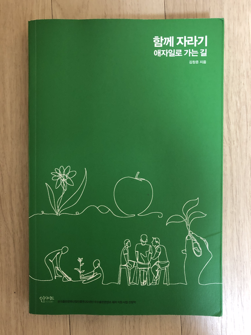
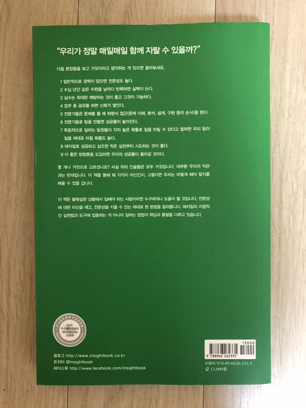

"우리가 정말 매일매일 함께 자랄 수 있을까"

<!-- more -->

**"우리"**라는 단어와 **"자랄 수(성장)"** 에 꽂혀서 집게된 책

### 자라기

1만시간: 자신의 기량을 향상시킬 목적으로 반복하는 수련 시간을 말하는 것
"의도적수련 Deliberate Practice"이 매우 중요

학습을 최대로 향상

- 피드백을 짧은 주기로 얻는것
- 실수를 교정할 기회가 있는것

수파리- 검도 불교 용어
우선 규칙을 지키고
규칙을 깨뜨리고
규칙 자체를 넘어선다

### 신뢰를 쌓는 공유인가 신뢰를 깎는 공유 인가

신뢰자산 높은 조직은 커뮤니케이션 효율이나 생산성이 높다.
신뢰자산 - 조직원들간에 높은 수준의 신뢰가 기반

신뢰를 쌓는 상식적 방법 : 투명성과 공유, 인터렉션
But 정말 신뢰가 쌓이는가?(공유조건별 신뢰도 변화 실험,측정도구 Subjective Value Inventory)
한가지 작업물, 최고 작업물 공유: 신뢰도 떨어짐

why?
상대방에게 최고 작업물이 아닐것 같은 불안감(방어적)
솔직한 의견내는 것도 꺼림
듣는사람도 방어적임 느낌
상대방의 부정적의견, 하나의 작품 = 나, 나에대한 공격, 자기효능감 하락

복수개 프로토타입 작업물 공유: 신뢰도 높아지고, 성과도 굿

### 객관성의 주관성

품질이란 누군가에게 가치가 되는 것이다.
고품질을 얻으려고 노력하는 사람들은 '인간'에 대한 이해가 필수적

감정을 배제할 수 없다.
감정과 의사결정을 연결하는 특정 뇌영역에 손상을 입은 환자들에 대한 연구

- 논리 문제, 높은 IQ 테스트 점수
- 결정과 관련된 인지적 작업에서 문제 - 식당 결정 같은 사소한 결정도 하지 못함

의사결정을 하는 과정에 감정적이고 직관적인 부분이 큰 역할을 하고 있으며, 그런 감정적 부분이 배제된다면 의사결정을 제대로 할 수 없다.

### 쾌속 학습팀

지금 당장하지 않는다면 장차 할 확률은 절반이하로 떨어집니다. 일단 30분만 업무 개선을 기도해 보는 겁니다.
학습속도를 놓이는 게 얼마나 도움이 될지.

워드 커닝햄 명언
"작지만 유용한 프로그램을 매일 작성할 것을 추천합니다"

### 프로젝트 확률론

"관심사의 섞임(mingling of concerns)을 통해 서로에 대해 엄청 나게 많은 것을 매우 빨리 배울 수 있기 때문입니다. 이런식으로 학습한 지식은 관리자나 혹은 누구든 딱한사람이 모델링한 것의 위험을 피할 수"

### 애자일 도입 성공 요인 분석

전문가팀은 무섭고 두렵더라도 중요한 일이라면 그 일을 안하는 리스크를 인식하고 꾸준히 시도한다는 점

“두려워도 중요하다면 시도해봐야하지 않겠는가”

### 애자일을 애자일스럽게 도입하기

불확실한 것에 대한 확실한 전략은 정해진 수순을 따르는 것이 아니라 곁에 있는 사람과 함께 주변을 탐색하고 조금 나아가고 확인하고를 반복하면서 우리의 현 맥락에 맞는 좋은 전략들을 스스로 만들어 나가는 것

