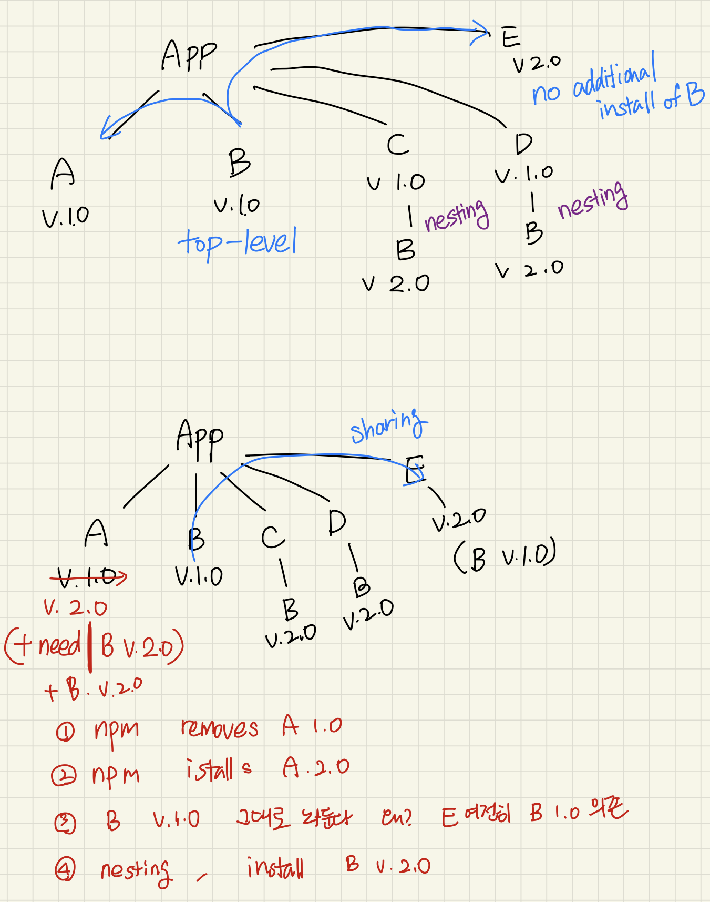
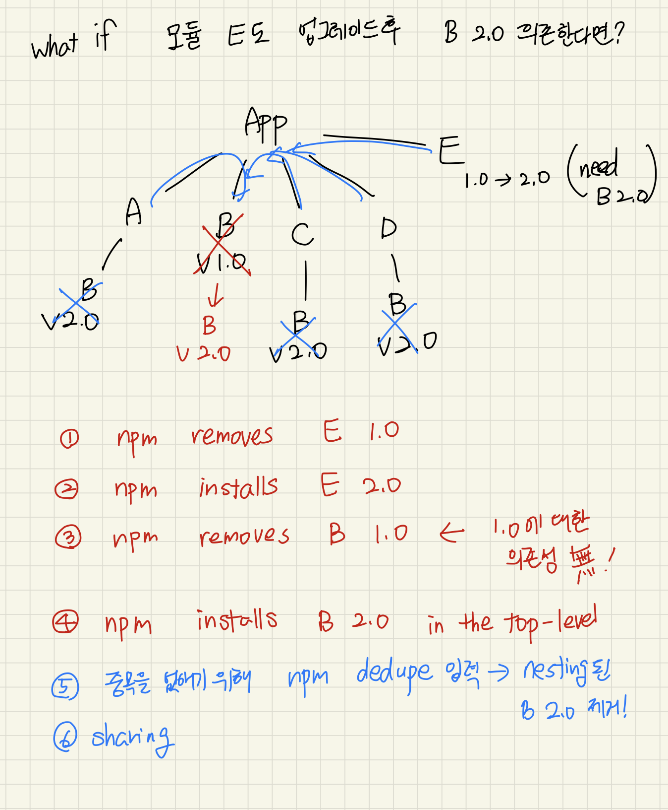

### 모듈 A가 최신버전으로 설치되는 데, 왜 이전 버전이 왜 추가로 설치되는 거지?

개발을 하던 도중 어떤 모듈의 버전을 올리면서 각 모듈들의 의존성에 대해 이해해야 했고, 그것을 정리해여 글로 남기려고 합니다.

Node packaged Magager(npm)를 사용해 저희는 개발에 필요한 모듈 패키지들을 편리하게 설치하고 제거하여 개발하고 있습니다. 하지만 때로는 각각의 패키지들이 연결 되어있는 경우가 있습니다. 그것을 "모듈 의존성" 이라고 합니다. 예를 들어, 모듈 A를 사용하기 위해서는 모듈 B 1.0 버전을 설치해야 합니다. 이때 "모듈 A는 모듈 B에 의존한다" 라고 말합니다.

<!-- more -->

`npm intall` 을 실행하면 `npm` 는 `pakage.json` 파일을 찾고 의존성 트리를 만들 준비를 합니다. 가장 간단한 트리를 만드려고 합니다. 가능한 가장 깊이가 얕고, 가지가 적은 나무를 말입니다. 어떻게 이런 나무를 만들 수 있을 까요? 이 물음에 대한 답을 통해 npm install 이 어떤 식으로 모듈들을 설치하고 제거 하는지 알 수 있었습니다.

다음은 저의 질문에 답을 주었던 글이고, 아래는 이 글을 읽고 정리한 내용입니다.
[Understanding npm dependency resolution](https://medium.com/learnwithrahul/understanding-npm-dependency-resolution-84a24180901b)

### 추가 point!

- `npm install` 시, module은 `알파벳 순서`로 설치된다.
- `package.json` 파일과 `npm install`을 사용하면 동일한 의존성 트리를 만들수 있다.

